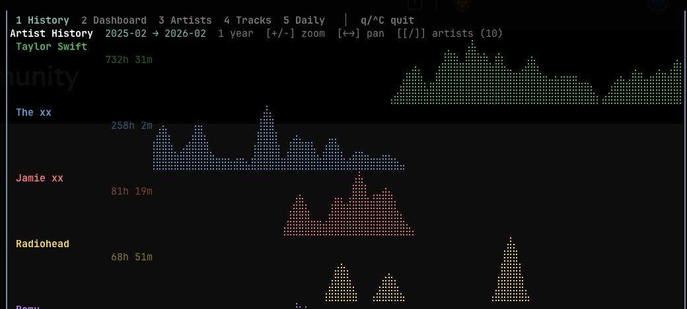

# level13

Personal Spotify Wrapped, available whenever you want it. Built primarily to document a Taylor Swift obsession.



## What it does

Polls your Spotify "Recently Played" every 3 minutes and stores everything in a local SQLite database. Pair that with a one-time import of your Spotify GDPR export and you get complete listening history with a terminal dashboard to browse it.

## Setup

**Prerequisites:** Node.js 22+, a Spotify app (free at [developer.spotify.com](https://developer.spotify.com))

```sh
git clone https://github.com/ryanbreen/level13
cd level13
npm install
```

Create a Spotify app, set the redirect URI to `http://127.0.0.1:8765/callback`.

## First-time setup

```sh
# 1. Authenticate with Spotify (opens browser, saves tokens locally)
node dist/cli.js auth   # prompts for Client ID + Secret on first run

# 2. Install as a background service (auto-starts at login, restarts on crash)
node dist/cli.js service install

# 3. Launch the TUI
./start.sh
```

That's it. The poller runs silently in the background from here on.

## Usage

```sh
./start.sh                    # launch TUI (builds in ~100ms via esbuild)
node dist/cli.js tui          # same, after a manual build
node dist/cli.js stats        # print summary to terminal
node dist/cli.js poll status  # check poller health + last sync time
```

### Import your full history

The poller only captures plays while your laptop is open. To fill gaps (phone, car, other devices) download your Extended Streaming History from Spotify (Account → Privacy → Request data), then:

```sh
node dist/cli.js import ~/Downloads/my_spotify_data.zip
```

Re-importing is safe — duplicates are silently ignored. Import as often as you like.

## TUI

| Key | Action |
|-----|--------|
| `1–5` | Switch tabs |
| `q` / `Ctrl+C` | Quit |
| **History tab** | |
| `+` / `-` | Zoom in / out |
| `0` | Reset to all-time view |
| `←` / `→` | Pan through time |
| `[` / `]` | Fewer / more artists |
| **Artists / Tracks tabs** | |
| `[` / `]` | Shorter / longer time range |
| **Daily tab** | |
| `←` / `→` | Previous / next day |
| `t` | Jump to today |

### Tabs

1. **History** — braille dot-matrix area chart, one artist per row, across your full listening history. Zoom from all-time down to 1 month. Each artist's peak day normalises to full height so you can see relative activity patterns even for artists you listen to rarely.
2. **Dashboard** — today's listening, current streak, year-to-date totals, top artists and tracks this week.
3. **Artists** — full ranked list by total listening time, with time range filter.
4. **Tracks** — same for tracks.
5. **Daily** — navigate day by day and see every play in order.

## Data

Everything lives in `~/.local/share/level13/level13.db` — a plain SQLite file. You own it.

## Stack

- [Ink](https://github.com/vadimdemedes/ink) — React for the terminal
- [better-sqlite3](https://github.com/WiseLibs/better-sqlite3) — SQLite
- [esbuild](https://esbuild.github.io) — bundles JSX in ~100ms, no watch step needed
- [commander](https://github.com/tj/commander.js) — CLI
